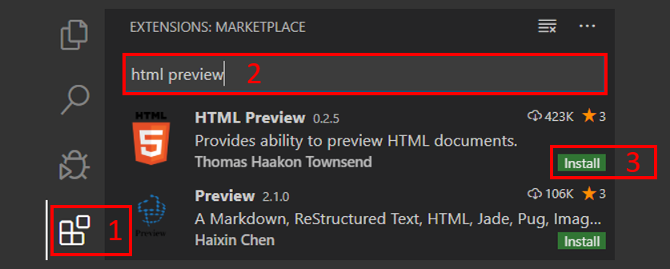
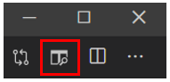
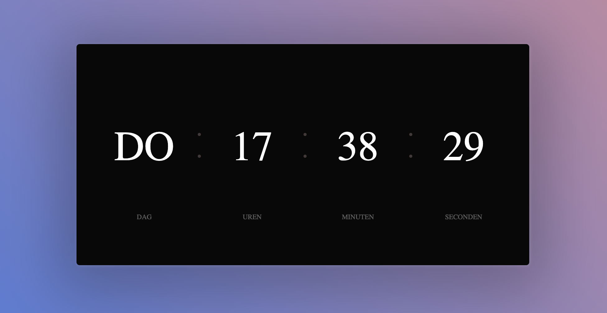

Er zijn een paar verschillende *talen* die samen voor een belangrijk deel
bepalen wat er op websites staat (HTML), hoe ze eruit zien (CSS) en hoe ze
werken (JavaScript). 

<!--more-->

## Introductie

Afhankelijk van hoeveel ervaring je al hebt met deze talen kun je beginnen
bij de basis, of een vervolgpagina kiezen. De instructies bestaan uit een
deel uitleg met tussendoor opdrachten om te oefenen met alle onderdelen.

## Benodigdheden

Voor deze instructies gebruiken we Visual Studio Code (VS Code) om de code te
schrijven, en om het resultaat te bekijken. Download en installeer eerst
VS Code:
[Download Visual Studio Code](https://code.visualstudio.com/download)

1. Ga nu naar het Extensions menu.
2. Zoek naar de extensie *HTML Preview*.
3. Installeer de extensie en herstart VS Code.

Om een html-pagina te laten zien in VS Code moet je op het `preview` icoon
klikken, dit bevindt zich rechtsboven in het scherm (let op: het is alleen
zichtbaar als je een bestand van het soort .html open hebt, niet bij
bijvoorbeeld een .txt bestand):

Je bent nu klaar om te beginnen met de instructies!

## Onderdelen van een HTML-pagina (basis)

### Structuur van een pagina

Websites worden geschreven in de taal van het internet: HTML. Er zijn veel
verschillende "woorden", of "bouwblokken", in HTML. Een aantal van de meest
gebruikte leer je hier kennen.

Een HTML-pagina heeft een paar standaard onderdelen:



  <!DOCTYPE html>
  <html>
  <head>
  </head>
  <body>
    <h1>Dit is een kop</h1>
    
Dit is een alinea.

  </body>
  </html>


 - HTML onderdelen worden aangegeven met *tags*: de naam van het onderdeel tussen `<>` haakjes.
 - De meeste onderdelen hebben een *start* en een *eind* tag.
 - De eind tag heeft een *forward slash* dus `/` voor de naam, bijvoorbeeld `</html>`.
 - Tags worden altijd geschreven met *kleine letters*.

**Opdracht** Kopieer en plak de basisonderdelen in een nieuw bestand en sla dit
op als html-bestand (bijvoorbeeld *ninja.html*). **Let op**: pas nadat je het
bestand hebt opgeslagen krijgt de tekst ook verschillende kleuren. Als je deze
kleuren niet ziet kan het zijn dat je het bestand als tekst, dus eindigend op
*.txt* hebt opgeslagen. Zet nu ook de preview aan. Het resultaat zou er
ongeveer zo uit moeten zien:


      <h1>Dit is een kop</h1>
      
Dit is een alinea.



### De standaard onderdelen

 - `<html>`: dit is het hoofdonderdeel van een pagina. Alle andere onderdelen komen binnen de `<html></html>`
 - `<head>`: binnen dit onderdeel wordt informatie *over* de pagina gezet, bijvoorbeeld de titel.
 - `<body>`: binnen dit onderdeel staat alle tekst die *zichtbaar* is op de pagina, in het voorbeeld een kop `<h1>` en een alinea `
`.

**Opdracht** Voeg eens een alinea met als tekst je naam in de `<body>` van de
pagina toe. Zie je je naam verschijnen?

### Koppen

Om verschillende niveau's aan te geven op een pagina kun je *koppen* gebruiken.
Hiervoor zijn de `<h1>`, `<h2>`, `<h3>` (enzovoort) tags. Met deze tags
kun je je pagina een duidelijke indeling geven.

**Opdracht** Tot hoe ver gaan de niveau's eigenlijk? Bestaat `<h20>`?

**Opdracht** Maak een pagina die er zo uitziet:


    <h1>Heelal</h1>
    <h2>Melkwegstelsel</h2>
    <h3>Zonnestelsel</h3>
    <h4>Aarde</h4>


### De stijl van tekst

Je kunt op een aantal manieren tekst extra benadrukken: door woorden **dik** te
maken, of `schuin`. Hiervoor kun je bijvoorbeeld de tags `<b>` (voor bold) en
`<i>` (voor italic) gebruiken. Een aantal andere tags om extra effect aan je
tekst te geven zijn `<mark>` en `<del>`. De HTML-code


  Dit is <b>dik</b>


wordt dus


    Dit is <b>dik</b>


**Opdracht** Gebruik de onderdelen die hierboven genoemd zijn eens uit en maak
deze zin na (zet deze bijvoorbeeld onder de kop Aarde):


   De <b>dikke</b> <mark>gele</mark> bij vloog <i>schuin</i> over mijn
   <del>kop</del> hoofd.


### Links

Een superbelangrijk onderdeel van webpagina's zijn natuurlijk *links* naar
andere pagina's, op dezelfde site of op een andere. Denk maar eens aan
zoekmachines! Voor het maken van een link gebruik je de `<a>` tag. Het
*adres* van de link, dus waar deze naar verwijst, voeg je toe door het
*attribuut* `href` in de tag te zetten met als *waarde* het adres, op deze
manier:


  <a href="https://scratch.mit.edu">


**Opdracht** Probeer op deze manier maar eens een link naar je favoriete
website te maken. **Let op**: vergeet niet de aanhalingstekens om het adres
van de website.

Zie je de link niet? Dat komt omdat je nog niets hebt toegevoegd om op te
klikken! Dit komt tussen de start- en eindtag en mag tekst zijn, maar ook
bijvoorbeeld een afbeelding.

**Opdracht** Maak op de pagina een link naar je favoriete website met de tekst
"**Mijn favoriete website!**" (let op: de tekst is dik gedrukt, hoe moest dat
ook weer?). Werkt de link? Tip: zet in de link *https://* voor de naam van de
website.

### Plaatjes

Met alleen maar tekst zouden veel websites er maar saai uit zien. Plaatjes kun
je toevoegen aan je pagina met de `` tag. Ook hier heb je weer een
*attribuut* nodig, dat heet `src` (van *source*, Engels voor bron):


  


**Opdracht**: Pas de link van de vorige opdracht zo aan dat je het CoderDojo
logo hieronder gebruikt in plaats van de tekst die er staat. Download Hiervoor
het plaatje en sla het op in de map waar ook je html-pagina staat. Werkt de
link nu ook weer? **Let op**: je moet de hele naam van het plaatje gebruiken,
in dit geval is het een *png*-bestand.

## Stijl toevoegen met CSS (basis)

Zonder *stijl* heeft tekst op een webpagina een standaardkleur (zwarte letters
op een witte achtergrond), standaardgrootte en standaardlettertype. Je kunt
eindeloos variëren met stijl, en er zijn verschillende manieren om stijl toe
te voegen aan je HTML.

De opdrachten in deze instructie beginnen met deze HTML-code:


  <!DOCTYPE html>
  <html>
  <body>
    

      Dit is de best gestijlde regel HTML ooit!
    

    

      Hoewel, misschien is deze nog wel mooier...
    

  </body>
  </html>


Dit zou er in de preview zo uit moeten zien:


      

        Dit is de best gestijlde regel HTML ooit!
      

      

        Hoewel, misschien is deze nog wel mooier...
      



### Stijl toevoegen

De makkelijkste manier om stijl toe te voegen aan je HTML is door een `style`
attribuut toe te voegen aan een HTML-element, bijvoorbeeld:


  
Wat zou de kleur van deze tekst zijn?



In dit voorbeeld is *color* de *eigenschap* die je
wilt instellen, namelijk de kleur van de tekst. De *waarde* die je de tekst
geeft is hier *red*, dus rood.

### Spelen met kleur

De kleur van tekst bepaal je met de eigenschap *color*:
`
`. Kleuren instellen kan op verschillende manieren,
bekijk hiervoor de pagina :ref:`html-kleuren`.

**Opdracht** Maak de tekst van de eerste alinea groen, en die van de tweede
paars:


    
Dit is de best gestijlde regel HTML ooit!

    
Hoewel, misschien is deze nog wel mooier...



Je kunt niet alleen de kleur van de tekst zelf, maar ook de achtergrond
veranderen, dit doe je met de eigenschap *background-color*:
`
`.

**Opdracht** Maak de tekst van de eerste alinea rood met een zwarte
achtergrond, en die van de wit met een oranje achtergrond:


    
Dit is de best gestijlde regel HTML ooit!

    
Hoewel, misschien is deze nog wel mooier...



### Tekstgrootte aanpassen

Eén manier om letters van verschillende grootte te maken is door :ref:`koppen`
te gebruiken. Dat is niet altijd handig (waarom is nu niet belangrijk) en het
kan ook met de eigenschap *font-size*. Een voorbeeld:


  
Groot!



geeft dit resultaat


    
Groot!



In dit voorbeeld is *px* gebruikt om aan te geven hoe groot de tekst moet zijn,
dit is de grootte in pixels op het scherm. Je kunt ook procenten gebruiken,
waarbij 100% de "standaard" grootte is: `
`.

**Opdracht** Maak de eerste zin van je pagina zo groot dat ie nog net op één
regel past, en de tweede zo klein dat je 'm nog nét kunt lezen.

### Verschillende soorten letters gebruiken

Naast de kleur en de grootte kun je ook nog het soort letters veranderen. Dit
doe je met de eigenschap *font-family*:
`
         
      </head>
      <body class="container">
         Wat is je naam? 
        <input id="inputId"> </input>
      </body>
      </html>


Als de gebruiker nu iets typt, zie je alleen de tekst staan. Er gebeurt verder
nog niet zo veel. Kun jij ervoor zorgen dat de computer terugpraat?

 - Voeg een knop toe aan de HTML pagina
 - Als je op de knop klikt, log dan de text die in het input veld staat met
  `console.log`. Om de tekst uit het invoer veld te halen kun je gebruik
  maken van: `const input = document.getElementById("inputId").value;`
 - Kun jij nu de computer `Hallo <naam>` laten zeggen? Je kan dit doen met de
  functie `alert()`, hier moet je nog wel text aan meegeven. Dit is een
  voorbeeld: `alert("Hoi Kevin!")`

## Stijl toevoegen met CSS (vervolg)

Maak voor de opdrachten in deze instructie een HTML-bestand met deze inhoud:


  <!DOCTYPE html>
  <head>
  
  </head>
  <body>
    <h1>Deze pagina gaan we stylen!</h1>
    <h2>Dit is een h2 kop</h2>
    

      <h2>Dit is ook een h2 kop!</h2>
        
Wat zullen we met deze alinea gaan doen?

        
Deze alinea wordt nog mooier dan de vorige.

    

    

      
De vorige alinea's zijn jaloers op mij.

      
Jaloers op mij zul je bedoelen!

    

  </body>
  </html>


Tot nu toe heb je stijl toegevoegd door `style="..."` te gebruiken in de
HTML-onderdelen. Dat heeft voordelen en nadelen. Het is handig dat je meteen
kunt zien hoe de inhoud van je webpagina eruit komt te zien. Minder handig is
dat je aan *ieder* stukje HTML op deze manier een stijl moet toevoegen. Dat is
én veel werk, én wordt al snel onoverzichtelijk als je veel stijlen hebt.

Het is daarom gebruikelijk bij webpagina's om de inhoud en stijl op
verschillende plekken neer te zetten. Een manier om dit te doen is binnen het
`
    </head>
    <body>
      <h1>Deze pagina gaan we stylen!</h1>
      <h2>Dit is een h2 kop</h2>
      

        <h2>Dit is ook een h2 kop!</h2>
          
Wat zullen we met deze alinea gaan doen?

          
Deze alinea wordt nog mooier dan de vorige.

      

      

        
De vorige alinea's zijn jaloers op mij.

        
Jaloers op mij zul je bedoelen!

      

    </body>
    </html>


### ID

Een andere manier is om een HTML-onderdeel een uniek *id* te geven:


  
Welke kleur is dit?



In de CSS verwijs je naar een id door een *hashtag* aan het begin te gebruiken:


  #ikbenuniek {
    color: red;
  }


**Opdracht** Maak de tekst van de eerste h1 kop blauw, en de 1e h2 kop groen
(tip: je hebt hiervoor twee id's nodig, "ikbenblauw" en "ikbengroen"):


    <!DOCTYPE html>
    <head>
    
    </head>
    <body>
      <h1 id="ikbenblauw">Deze pagina gaan we stylen!</h1>
      <h2 id="ikbengroen">Dit is een h2 kop</h2>
      

        <h2>Dit is ook een h2 kop!</h2>
          
Wat zullen we met deze alinea gaan doen?

          
Deze alinea wordt nog mooier dan de vorige.

      

      

        
De vorige alinea's zijn jaloers op mij.

        
Jaloers op mij zul je bedoelen!

      

    </body>
    </html>


Samengevat heb je nu gezien dat je stijl kunt geven aan

 - alle onderdelen van een bepaalde soort
 - bepaalde onderdelen door ze lid te maken van een class
 - losse onderdelen door ze een (uniek) id te geven

### Combineren van stijlen

Een grote kracht van CSS is dat je stijlen ook kunt combineren. Zo kun je
meerdere eigenschappen tegelijk instellen in een CSS regel:


  p {
    color: red;
    font-weight: bold;
  }


**Opdracht** Voeg een tweede eigenschap toe aan de "rodealinea", bijvoorbeeld
*background-color* of *font-family*.

Je kunt een onderdeel ook lid maken van meer dan één *class* (in dit voorbeeld
heten die "rodealinea" en "box"):


  
}}

**Opdracht** Maak een class "box" die de eigenschap `border` instelt op `1px
solid black`, en voeg deze toe aan een van de rode alinea's:


    <!DOCTYPE html>
    <head>
    
    </head>
    <body>
      <h1 id="ikbenblauw">Deze pagina gaan we stylen!</h1>
      <h2 id="ikbengroen">Dit is een h2 kop</h2>
      

        <h2>Dit is ook een h2 kop!</h2>
          
Wat zullen we met deze alinea gaan doen?

          
Deze alinea wordt nog mooier dan de vorige.

      

      

        
De vorige alinea's zijn jaloers op mij.

        
Jaloers op mij zul je bedoelen!

      

    </body>
    </html>


## Actie toevoegen met JavaScript (vervolg)

Nu je de basis van JS hebt gezien, gaan we wat verder met moeilijker
onderdelen.

### Een klok maken

We gaan een klok maken op een `HTML` pagina. Je kan de volgende `HTML`
gebruiken:


    <html>
    <head>
        
    </head>

    <body>
        

            

                

                

                

                    Dag
                

            

            

                

                

                

                    Uren
                

            

            

                

                

                

                    Minuten
                

            

            

                

                

                

                    Seconden
                

            

        

        
    </body>

    </html>


De klok werkt nu nog niet.. Kan jij dit oplossen? In het ``
blok moet jij de code gaan aanpassen, daarmee kun je de klok weer aanslingeren
;) !

## Het instellen van kleuren op je webpagina

Er zijn een een heel aantal manieren om een kleur in te stellen voor onderdelen
van je pagina, bijvoorbeeld

 - met `namen`_ `
`
 - met `RGB-waarden`_ `
`
 - met `HEX-waarden`_ `
`

### Namen

Er zijn 140 kleuren die een eigen naam hebben:

### RGB-waarden

RGB staat voor **R**ood **G**roen **B**lauw. Dit is ook de volgorde
waarmee je ze instelt in de code.  De waarde gaat van 0 (helemaal niks van
deze kleur) tot 255 (alles van deze kleur). Een paar voorbeelden:

| RGB code        | Rood  | Groen | Blauw | Kleur      |
|:---------------:|:-----:|:-----:|:-----:|:----------:|
| (0, 255, 0)     | 0     | 255   | 0     | groen      |
| (255, 0, 255)   | 255   | 0     | 255   | magenta    |
| (173, 216, 230) | 173   | 216   | 230   | lichtblauw |

### HEX-waarden

 - HEX is een afkorting voor hexadecimaal, wat een manier van tellen is die vaak
  wordt gebruikt bij computers.
 - In plaats van de 10 cijfers (0 t/m 9) waar we meestal mee tellen tel je hier
  met 16 "cijfers", namelijk 0 t/m 9 en A t/m F.
 - De HEX code voor een kleur is zes cijfers lang: de linker twee bepalen
  hoeveel rood er in de kleur zit, de middelste twee hoeveel groen en de
  rechter twee hoeveel blauw. 00 is de laagste waarde (omgerekend 0), FF is de
  hoogste waarde (omgerekend 255).
 - De zescijferige code staat in de HTML-code na een #.

De kleuren van de RGB-voorbeelden zijn in HEX code

| HEX code | Kleur      |
|:--------:|:----------:|
| 00FF00   | groen      |
| FF00FF   | magenta    |
| ADD8E6   | lichtblauw |

## Bronvermelding afbeeldingen
 - [HTML logo by W3C](https://commons.wikimedia.org/wiki/File:HTML5_logo_and_wordmark.svg)
 - [CSS logo by Rudloff](https://commons.wikimedia.org/wiki/File:CSS3_logo_and_wordmark.svg)
 - [JS logo by Omed Habib](https://commons.wikimedia.org/wiki/File:Javascript-shield.svg)
 - [SVG_Recognized_color_keyword_names by Monaneko](https://commons.wikimedia.org/wiki/File:SVG_Recognized_color_keyword_names.svg)


