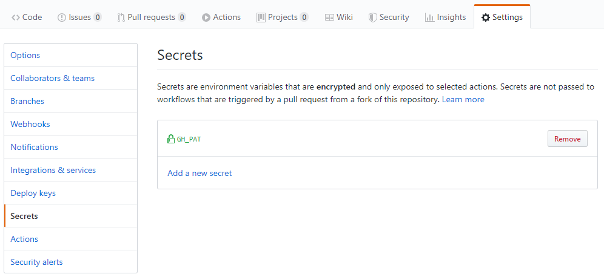
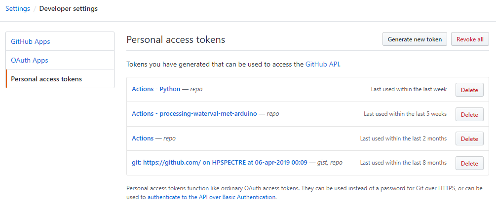
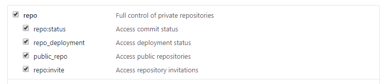
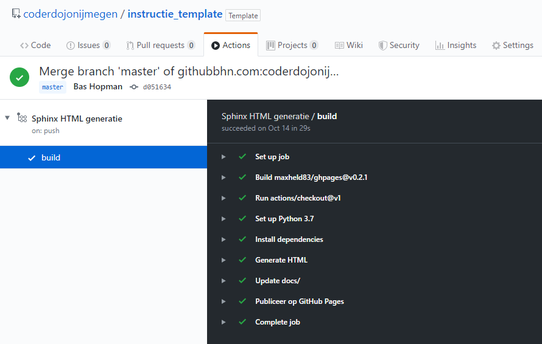

Het template gebruiken
======================

De template repository gebruiken
--------------------------------

De repository maken
^^^^^^^^^^^^^^^^^^^

Github ondersteunt het kopiëren van een repository als template. De repository waarin deze instructie staat, is zo'n
template repository. Je kunt het gebruiken door er naar te navigeren in de browser: https://github.com/coderdojonijmegen/instructie_template.

.. image:: imgs/github_use_template_repo.png

Vervolgens druk je op de knop "Use this template" om er een kopie van te maken.

Geautomatiseerd HTML genereren
^^^^^^^^^^^^^^^^^^^^^^^^^^^^^^

Het template bevat in de `.github/workflows` directory een yaml bestand dat het genereren van de HTML en het publiceren
op github.io automatiseerd. Daar hoef je in principe niets aan te doen.

Maar, het script gebruikt een *secret* dat je nog wel moet instellen. Om de gegenereerde HTML te publiceren, is een
personal access token (PAT) nodig. Deze moet als *GH_PAT* in de instellingen worden toegevoegd:



Overigens kun je een eigen PAT genereren in de settings van je gebruikers instellingen:



Met scope:



Na iedere push naar de repository wordt nu automatisch de HTML gebouwd en gepubliceerd op github.io:



Het template gebruiken
^^^^^^^^^^^^^^^^^^^^^^

Naast het aanpassen van bestaande .rst bestanden of het toevoegen van nieuwe .rst bestanden, zijn er twee bestanden
die aandacht verlangen: `conf.py` en `index.rst`.

conf.py
+++++++

In dit bestand hoef je eigenlijk alleen de naam van het project aan te passen. Op regel 21 vervang je huidige
project naam met het nieuwe.

index.rst
+++++++++

Het `index.rst` wordt gebruikt om het hoogste niveau van de menustructuur te bepalen
en de verschillende .rst bestanden in te linken.

Pas de instructie titel op regel 1 aan en vervang/voeg toe de .rst bestanden die je wilt gebruiken in je instructie.

Veel voorkomende opmaak
-----------------------

Hoofdstukken
^^^^^^^^^^^^

Hoofdstukken worden gemaakt door de titel te onderlijnen over de volledige lengte. Dus bijvoorbeeld:

.. code::

   ##########
   deel titel
   ##########

   ***************
   hoofdstuk titel
   ***************

   sectie
   ======

   sub-sectie
   ----------

   sub-sub-sectie
   ^^^^^^^^^^^^^^

   paragrafen
   """"""""""

Dit voorbeeld volgt `Python's Style Guid for documenting <https://docs.python.org/devguide/documenting.html#style-guide>`_,
maar in principe zegt het karakter niets over welk niveau het is. De niveaus worden bepaald door de volgorde van de
karakters als onderlijning.

Tekst formatering
^^^^^^^^^^^^^^^^^

 - `*schuin*` : *schuin*
 - `**vet**`: **vet**
 - `\``code\```: ``code``

Lijsten
^^^^^^^

.. code::

   * dit is een lijst met bullets
   * het heeft twee items, waarbij het tweede
     twee regels beslaat.

   1. dit is een genummerde lijst
   2. het heeft ook twee regels

   #. dit is een automatisch genummerde lijst
   #. het heeft ook twee regels

Geneste lijsten zijn ook mogelijk, maar moeten wel door een lege regel van elkaar gescheiden worden:

.. code::

   * dit is een lijst
   * met meerdere regels

     * en meerdere
     * niveaus

   * en dan weer door

Zo dus:

 * dit is een lijst
 * met meerdere regels

   * en meerdere
   * niveaus

 * en dan weer door

Tabellen
^^^^^^^^

.. code::

   +------------------------+------------+----------+----------+
   | Header row, column 1   | Header 2   | Header 3 | Header 4 |
   | (header rows optional) |            |          |          |
   +========================+============+==========+==========+
   | body row 1, column 1   | column 2   | column 3 | column 4 |
   +------------------------+------------+----------+----------+
   | body row 2             | ...        | ...      |          |
   +------------------------+------------+----------+----------+

Wordt:

+------------------------+------------+----------+----------+
| Header row, column 1   | Header 2   | Header 3 | Header 4 |
| (header rows optional) |            |          |          |
+========================+============+==========+==========+
| body row 1, column 1   | column 2   | column 3 | column 4 |
+------------------------+------------+----------+----------+
| body row 2             | ...        | ...      |          |
+------------------------+------------+----------+----------+

Of simpeler, maar beperkter:

.. code::

   =====  =====  =======
   A      B      A and B
   =====  =====  =======
   False  False  False
   True   False  False
   False  True   False
   True   True   True
   =====  =====  =======

Wordt:

=====  =====  =======
A      B      A and B
=====  =====  =======
False  False  False
True   False  False
False  True   False
True   True   True
=====  =====  =======

Links
^^^^^

``http://url.com`` wordt http://url.com

```label <url>`_`` wordt `label <url>`_.

Als de link meerdere keren op de pagina wordt gebruikt, kun je de link en de doel definitie scheiden:

.. code::

   | Dit stukje bevat een `link`_.
   | En deze regel dezelfde `link`_.

   .. _link: http://url.com

Wordt:

| Dit stukje bevat een `link`_.
| En deze regel dezelfde `link`_.

.. _link: http://url.com

Plaatjes
^^^^^^^^

.. code::

   .. image:: imgs/plaatje.jpg

   .. image:: imgs/plaatje.jpg
      :height: 100px
      :width: 200 px
      :scale: 50 %
      :alt: alternate text
      :align: right

Waarbij het plaatje relatief ten opzichte van de ``source/`` directory staat.

Meer informatie
^^^^^^^^^^^^^^^

Meer gedetaileerde informatie over reStructuredText kun je vinden op http://docutils.sourceforge.net/rst.html.

Toevoegingen aan het template
-----------------------------

Scratch blokken gebruiken
^^^^^^^^^^^^^^^^^^^^^^^^^

Je kunt in de instructies gebruik maken van Scratch blokken. Gebruik daarvoor de volgende code:

.. code::

   .. raw:: html

      <div class = "scratch">
          when flag clicked
          clear
      </div>

En dat resulteert dan in:

.. raw:: html

   <div class = "scratch">
       when flag clicked
       clear
   </div>

Voor meer informatie over de te gebruiken blokken vind je op de Scratch Wiki:
`Block Plugin/Syntax <https://en.scratch-wiki.info/wiki/Block_Plugin/Syntax>`_

Uitklapbaar element
^^^^^^^^^^^^^^^^^^^

Regelmatig worden Ninja's gestimuleerd om eerst zelf eens te proberen iets uit te vinden. Mocht het niet lukken,
dan kan er een voorbeeld worden open geklapt.

.. code::

   .. container:: toggle

      .. container:: header

          klik om voorbeeld te tonen

      .. code:: python

         def toon_voorbeeld:
           println('voorbeeld')


.. container:: toggle

   .. container:: header

      klik om voorbeeld te tonen

   .. code:: python

      def toon_voorbeeld:
        println('voorbeeld')


HTML genereren
--------------

Hoewel het HTML genereren zoveel mogelijk geautomatiseerd wordt uitgevoerd na het pushen van de reStructuredText, is het
handig om ook lokaal de HTML te genereren om te zien hoe het er uit ziet vóórdat het gepushed wordt.

Het commando om de HTML te genereren is:

.. code::

   sphinx-build -M html source/ build/

Op Ubuntu met `build-essential` geïnstalleerd, kun je ook shell-script `make` gebruiken:

.. code::

   make html

In beide gevallen komt de gegenereerde HTML terecht in the `build/html` directory.